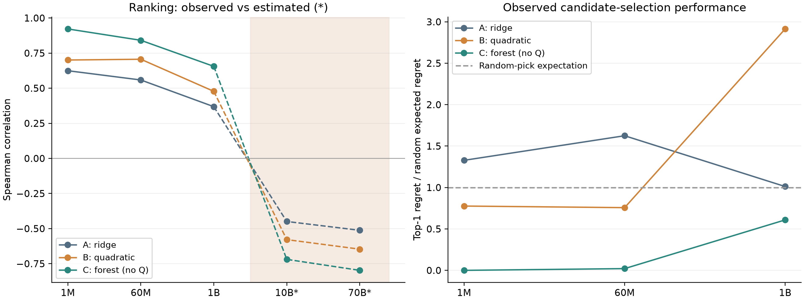

# 三条 baseline 分析报告：从配比预测到可信资源配置

核验日期：2026-09-23；版本：完整上传后的修订版。本文是队内研究评审材料，区分已运行产物、独立核验、模型推论和待实施建议。

## 1. 核心判断

**建议采用“C 的配比预测 + B 的有效数据量机制 + C 的来源辨识诊断 + A 的成本解析校验”构成主链，修正后再运行质量联合优化；B 的第四问可作为能力桥接与前沿分析的起点。** 不建议直接选一条路线全盘照搬，也不宜把三个算法串成论文的三章。

现有最有价值的科学问题是：**同尺度预测改善，何时能够变成跨尺度、固定预算下可靠的决策收益？** 三线提供了正反两方面证据：C 在真实配方检验上明显更强；B 的二次模型在 1B 上却选到候选集中最差的配方；所有质量机制仍主要受半合成来源支撑，跨来源不一致。

同时，本次发现必须先处理的实现问题：**B、C 第三问均把按“十亿参数/十亿 Token”拟合的系数直接用于实际个数，导致 Loss 被压到不可约项附近。两线当前最优配置和转移阈值不能作为论文有效结果。** C 第三问还混合了可信区域内方案与区域外对照。成本校验、梯度自检和同一错误公式的解析对照通过，不能排除这些接口错误。

实现错误应在整合时修复，不能包装为“模型不确定性”或物理机制。修复后的跨来源分歧与策略稳定性，才是论文要研究的对象。

## 2. 版本、范围与核验

用户补充上传后，重新同步远程并按以下 Git 对象冻结分析。旧 `origin/baseline-c` 是此前缓存的 Q1 引用；C 完整成果实际分布在三个分支，不能只检查该旧引用。

| 路线 | 分支与提交 | 当前交付 |
|---|---|---|
| A | `baseline-a`：`eed45774a89192ce914b15479cc193139097d308` | Q1–Q3 完整代码、配置、结果；Q4 暂缓 |
| B | `baseline-b`：`03921456b512d2c8dbd5ed052ef0f22d8de91412` | Q1–Q4 代码、结果、论文及图表 |
| C1 | `baseline-q1-c`：`e35bf06f506cf3e7a5fc93b06e8a77fa39a8c1f3` | Q1 质量与配比 |
| C2 | `baseline-q2-c`：`6f101de192768f449b27ca4d8bf84c0fcb0a6ebc` | Q2 双通道、来源诊断及接口 |
| C3 | `baseline-q3-c`：`70c0accac07a9be4fe67b81d38c7a4d0af420403` | Q3 候选枚举、局部搜索及核验 |

遵循 AGENTS.md，以干净版数据说明和 DOCX 原题为准；原始数据只读，没有切换或合并分支。使用三个 lunar 子 agent 调查，主 agent 综合并独立复核。没有重新训练全部模型或修复他人代码。

本次实际执行的验证：

- 从固定 Git 提交保存证据快照、源码、配置及哈希，见 [manifest.json](./manifest.json) 与 [分支清单](./branch_inventory.json)。
- A/C 五组保存预测的候选 ID、13 域等权真实 Loss 一致，25 组模型/集合指标独立重算通过。
- 从 B 已保存的 `q1_mixture_model.npz` 和原始配方 CSV 重建线性、二次预测，10 组检验/外推指标与报告相符。合计 35 组记录见 [三线复核表](./q1_three_lines_verified.csv)。
- A 的 15 个成本场景复核通过；B/C 的损失单位反例、C 的 720 个成本可行性及可信区域检查见 [新分支核验](./new_branch_verification.json)。修正单位后对原点重新评分，仅用于诊断，**没有把它当成重算后的最优解**。

复现本次分析：依次执行本目录的 `collect_evidence.py`、`verify_new_branches.py`、`plot_comparison.py`。这验证保存产物与公式，并不替代原训练环境的完整复现。

## 3. 第一问：C 预测最强，但质量机制仍未被独立识别

### 3.1 三线质量评分并非同一个输入上的三种赋权

| 路线 | 实际实现 | 数据与口径限制 | 论文用途 |
|---|---|---|---|
| A | 22 维等权、语义组冲突、最弱组修正；λ=0.1 | A1 参考归一化；分组基数影响冲突；部分方向约定需核验 | 可解释质量基准与全量审计 |
| B | 组内均值、组间几何均值与短板加权；λ=0.3 | 实际不是任务卡中的 PCA 主线；使用同源重建集，A1=50,412，与原 51,230 不同 | 作为另一质量定义的敏感性，不能冒充同一原始全量复算 |
| C | 熵权与等权对照、冲突阈值、短板消融 | 使用外部冻结预处理；语义分组/阈值与 A 不同；有效指标数 8.16/22 | 质量定义敏感性与领域冲突诊断 |

A/C 都记录 A1=51,230、A2=17,523、A3=203,752，按域/ID 去重后 261,086，其中 github=203,752、book=171。扩展检查不是独立随机重复实验；合并均值不代表领域均衡。

B 的 [质量元数据](./evidence/B/results/q1_quality_meta.json) 明确来源为“同源重建”，域组成也不同；[文件审计](./evidence/B/results/audit_files.csv) 记录原质量文件为 LFS 指针。新上传的重建 `.jsonl.xz` 仍需 LFS 实体及重建溯源才能复核，不能把指针当压缩数据读取。即使同源抓取合法且完整，也不自动等于题目指定 A1/A2/A3 全量记录。优先复用 A/C 的原附件审计口径，在同一质量矩阵上重跑 B 评分。

C 配置依赖当前未提供的 `../q1_preprocessing/`。哈希与得分表足以审核现有结果，但不能重建缺失的预处理输入。A/C 域级 Q 的大小及冲突率不能直接排名：两套 [0,1] 得分的坐标不同。例如 A 的 arxiv≈0.586，C resolved≈0.551，C 下游又使用 entropy≈0.468，需明确到底传递了哪一个 Q。

建议保留评分解释性、原文分层核验、域排序区间；不把熵权大解释成指标更重要，也不把“专业文本低分”未经原文检查就解释成评分偏见。

### 3.2 配比建模：三线同目标比较

固定评价目标为 13 域等权 Loss；A 岭回归、B 二次混料、C 无 Q 森林为代表性对照。B 的混料实验使用相同原始配方数据，因此其质量重建问题不使这部分比较自动失效。三线种子、表示和选参目标仍有差异，以下不是只改变一个算法的严格消融。

| 真实 1M 检验，256 配方 | RMSE | R² | Spearman | top-1 后悔值 |
|---|---:|---:|---:|---:|
| A：岭回归 | 0.22776 | 0.3273 | 0.6246 | 0.7086 |
| B：二次混料 | 0.19937 | 0.4846 | 0.7008 | 0.4140 |
| C：无 Q 森林 | 0.11874 | 0.8172 | 0.9221 | 0.0000 |

C 相对 A 的 RMSE 下降约 47.9%，相对 B 约 40.4%；百分比只对应上述固定目标和具体实现。C 的逐目标森林进一步达到 0.04773 / R²=0.9705，但它复用多输出模型超参数，未独立进入同样搜索，应列作补充探索，不从最终测试中择优后称为预先胜出的主模型。

| 集合 | A/B/C Spearman | A/B/C top-1 后悔值 | 证据性质 |
|---|---|---|---|
| 60M，256 配方 | 0.5586 / 0.7063 / 0.8413 | 0.6179 / 0.2878 / 0.0080 | 真实检验 |
| 1B，64 配方 | 0.3685 / 0.4776 / 0.6556 | 0.1156 / 0.3329 / 0.0696 | 真实检验 |
| 10B，63 配方 | −0.4494 / −0.5786 / −0.7193 | 0.3587 / 0.3587 / 0.3587 | 模型估算，配比取自训练子集 |
| 70B，63 配方 | −0.5122 / −0.6466 / −0.7975 | 0.4072 / 0.4072 / 0.4072 | 模型估算，非独立真实验证 |

图左的阴影区域为估算表，虚线连接仅作视觉导引，不表示真实连续尺度规律。图右采用后悔值/随机抽取期望后悔值，超过 1 表示这次点推荐差于随机期望；它不是多次真实训练的平均效果。

**最值得写进论文的发现：预测精度与决策质量并不等价。** B 在 1B 上排序相关优于 A，却选到候选集合的最差配方：后悔值 0.332931 等于该集合真实 Loss 极差，是随机期望 0.114261 的约 2.91 倍。A 在 1M、60M 上也出现低于均值基准的预测误差与高于随机期望的选方后悔并存。

后悔值定义为选中配方的真实 Loss 减去当前候选集最小 Loss；不能解读为全单纯形全局最优差距。跨尺度绝对 Loss 未校准时，主要看排序与选方；估算表反号只说明模型与给定外推表不相容，不能直接断言真实大模型规律反转。

### 3.3 “质量特征有效”的结论应降级

C 的无 Q 森林 RMSE=0.11874；熵权特征森林为 0.11658，改进约 1.8%；proxyQ 变体为 0.11750。B 的二次+Q 在 1M 上从 0.19937 降到 0.18286，在 1B 上 top-1 后悔值从 0.33293 变为 0，但 Spearman 从 0.4776 略降到 0.4734，推荐对表示/正则化很敏感。

若 Q(p)=qᵀp，Q 是已有配比的确定函数；在线性/二次设计中新增此列会改变岭惩罚几何，但不会新增独立观测信息。森林可能因新切分方向而改善，也不能据此识别质量因果通道。因此可以写“该表示改善了预测/点选方”，不能写“证明投入质量造成同等收益”。

B 的 `cv_alpha` 注释称标准化 RMSE，实际选择用的是逐元素绝对误差除目标标准差；应按实际代码说明为标准化 MAE 型准则。C 用最终测试目标线性度归纳的模型选择规则属于事后诊断，若据此构建混合预测器，必须回到训练内部选择。

## 4. 第二问：经典项一致，质量项依赖来源与模型设定

### 4.1 共同经典基准与证据边界

三线经典项几乎一致，采用十亿单位 n=N/10⁹、d=D/10⁹：

\[
L_0=E+A n^{-\alpha}+B d^{-\beta},
\quad(E,A,\alpha,B,\beta)\approx(1.6898,0.3540,0.3400,1.2403,0.2799).
\]

| 数据 | 经典项误差 | 正确解释 |
|---|---|---|
| B1，1,176 检查点 | RMSE≈0.0001465，R²≈0.9999998 | 表内高度吻合；8 条轨迹而非 1,176 个独立训练实验 |
| B2，1,029 半合成点 | RMSE≈1.2431，R²≈−5.0728 | 跨来源退化，不能用单源拟合掩盖 |
| B4，57 跨族点 | RMSE≈0.2927，R²≈0.6045 | 有解释力但存在水平偏差 |
| B5，44 文献点 | RMSE≈0.1976，R²≈0.7306 | 需分来源和验证语料口径 |
| B3，4,000 插值点；B10，128 估算点 | 误差很小 | 插值/公式估算一致性，不是新泛化证据 |

B 把 B1 标为“公式生成”，其依据主要是拟合残差接近舍入量级。C 补充检查了训练日志与元数据一致性。这些异常值得记录与溯源，但**仅凭近完美拟合不足以把题面标注的真实数据确定改判为伪造/生成数据**。论文应写“题面标为真实，内部规律异常接近幂律，来源独立性仍待核验”，并降低其对普适规律的证明强度。

### 4.2 三种质量模型的实际结果

| 路线 | 形式 | 已有结果 | 适用结论 |
|---|---|---|---|
| A | 加性 γ(1−Q) | B6/B7 γ≈0.363；B6 RMSE≈0.217→0.076；B8 γ≈−2.09 | 透明消融；来源冲突明显 |
| B | 有效数据 dQ^κh(p) | B6 分阶段 κ=1.0524，区间约[0.9817,1.1507]；B7≈1.0763；B8 κ命中下界0.02 | 可解释机制候选，质量证据仍为半合成 |
| C | 参数通道 nQ^ρ 与数据通道 dQ^κh(p) | M2 分阶段 κ=0.3821、ρ=0.5387、来源偏移δ=0.0594；推荐退回 M1，κ=0.8047、ρ=0 | 双通道在部分半合成来源内部受约束，不能认定真实机制已辨识 |

C 在 B1∪B6 的嵌套 SSE 由约 16.989，经来源偏移降到 6.800，再经单通道降到 3.420、双通道降到 1.640。最大的首段改善来自来源偏移；这非常适合解释“先解决来源兼容，再解释质量机制”。

C 的 B8 calibrated/extrapolated 分层拟合中，κ、ρ均压至零边界，M2 不再改善经典模型。B1 的 Q 统一约定为 1，本身对 κ、ρ 没有质量变化信息。B6/B7 内部的窄区间、多起点同解以及嵌套 F 检验，不等于真实训练机制成立；边界参数和受限非线性模型还使常规 F 检验的正则条件需要重新审查。

这里的 M1“Q2-B”是 C 自己的嵌套模型名称，并不等于独立 B 分支完整实现，不能把 κ=0.8047 与 B 的 1.0524 混为同一版本。

### 4.3 三个关键接口问题

1. **质量坐标未校准。** A 将 Q1 与 B 的 Q_score 视为同刻度，元数据明确 `verified=false`；B 用重建语料分且 Q3 基线固定0.5；C 使用六个映射域的 entropy 分，对未映射域剔除后归一化。分数取值都在 [0,1] 不足以统一收益和成本。
2. **配比收益没有可识别的跨尺度绝对强度。** 三线 h 或 λ 的幅度均需要情景设定。C 的 Q1 森林没有持久化可执行对象，Q2/Q3 因而用 `quality_linear`、`mixture_l1` 替代，**C 第一问已验证的森林优势并没有传到第三问**。
3. **C 的领域替代表归一化随候选改变。** `calibrate.py::mixture_effect` 用当前输入的 Q 标准差归一化；`substitution_table` 每次只传 p₀ 与一个新 p，于是任意非零变化都被放大为 Δ=±2，h=e^(∓2)，失去变化幅度差异。该表不能直接用于领域投入排序；需冻结同一个尺度后重算。主候选集使用固定尺度不受这个特定逐对重标度问题影响，但仍是未经标定的情景。

C 的 `loss_predictor.json` 默认参数是 M2，而推荐模型写 M1；调用方必须显式选择 M1 阶段并令ρ=0。仅阅读推荐字符串不会自动改变执行模型。

## 5. 第三问：A 可作基准；B/C 必须先修正再谈转移

### 5.1 A 的有效范围

A 固定 Q=Q₀≈0.5858、p=p₀，所以 CQ=0，三类质量成本全部不激活。15 场景数值与解析 Loss 最大相对差约2.15×10⁻¹⁶，N最大相对差约1.33×10⁻⁷；7场景超出 B1 支持域。它是可靠的固定质量 N–D 基准，不能替代质量联合优化。

固定上下文、无额外边界时，N*∝C^0.4516，属于模型结构推论；没有结构转移并不意外。ℓ=2048 的三预算解约为：0.2213B/7.0497B、5.0069B/311.6047B、40.0506B/3895.4692B（N/D）；后两档分别存在 D 或 N、D 外推。

题设给出 Cattn/Ctrain=ηℓ/6，所以临界上下文为30,000；这不是注意力占总成本的比例。在 A 无质量成本情况下，ℓ=32768 注意力占总预算52.20%。联合质量投入后必须重新计算总份额。

### 5.2 B/C 的单位错误：已独立复现

B 的 [Q2参数](./evidence/B/results/q2_scaling_parameters.json) 明确 N、D 为十亿；但 [Q3代码](./evidence/B/code/q3_optimize.py) 的 `loss`（第52行起）对原始 N、D 直接做负幂。C 的 [Q2读取](./evidence/C2/src/baselines/Q2-C/common.py) 只重命名 N_params_B/D_tokens_B，没有转换；[Q3Model](./evidence/C3/src/baselines/Q3-C/model.py) 却说明使用原始个数并直接回代同一 A、B。

同一物理点 N=10⁹、D=10¹¹、Q=1、h=1：

| 计算 | Loss |
|---|---:|
| 正确十亿坐标 n=1、d=100 | 2.385578 |
| B/C 第三问现实现直接代入实际个数 | 1.691141 |

必须在损失端用 N/10⁹、D/10⁹，或将系数换为 A_raw=A_B·(10⁹)^α、B_raw=B_B·(10⁹)^β；成本端继续使用实际个数。导数与解析式也要同步，不能只修显示单位。

本次可按错误公式复现 B 的45行 Loss（在CSV舍入容差内）和 C 的720行 Loss。C 原点正确单位重评分的绝对差中位数约0.3202，最大约2.2517；这些只是固定旧决策点的反例，不是修正后的优化成果。

C 的“上游预测一致性”之所以全通过，是因为 `verify.py::upstream_consistency` 给上下游都传了10⁸–10¹¹量级的 N，两边同时误解单位。B 数值-解析同样共享了错误公式。这说明必须增加一个**具有物理单位的跨问锚点测试**，不能只比较两段代数相同的代码。

据此，B 当前约log₁₀C=19.6–21.1的质量启动阈值、C 的182个质量状态变化事件、两线全部 N*/D*/Q*及成本份额，均应标记“待修复重算”，不用于效果排名。预算可行性本身仍成立，只是不代表优化目标正确。

### 5.3 C 的额外约束与叙述问题

- **可信区域外候选参加主竞争。** 声明L1半径0.6，但主枚举没有按该硬约束筛除终选候选。720个胜出结果中360个 `in_trust_l1=false`；`lp_vertex_box` 距p₀为1.42250。可以单列区域外压力测试，不能把它和区域内解混排后称为同一可信域最优。
- **名为κ消融，核心表实际只有一个值。** `optimal_allocations.csv` 和 `budget_paths.csv` 都只有κ=0.804707。配置列了多个κ，并不意味着这些路径均已运行；报告“任意κ切换均不改变结论”的表述超出已保存证据。
- **配比不变的定理需要前提。** 当Q₀固定、可行域与p无关、h为唯一p通道时，最大化h确实独立于预算。但在 `Q0=Q(p)` 情景里，成本和Q下界也依赖p，不能单凭h可分离就推出同一结论；720个数值单元的一致不等于一般定理，且其中还含ω=0平局。
- **情景强度可能极大。** `quality_linear, ω=1` 的胜出h≈1.435×10⁷，相当于极强有效Token乘数，源于窄Q差异尺度s≈0.00428上的指数映射，未经训练数据标定。不能称为现实数据工程收益。
- **质量边界导数有单侧问题。** `loss_at_budget` 用 `(c>0)` 乘g′，在Q=Q₀处将质量成本导数置零；但允许向右提升时应取右导数g′(Q₀)。边界KKT和SLSQP核验应采用单侧定义。

因此可以保留 C 的候选生成、成本审计、多起点框架和“可分离模型不必有配比转移”的正确限定版本；暂不保留其顶点推荐、具体转移阈值和数值性能主张。

## 6. B 的第四问：有可复用成果，但尚未闭合全部接口

虽然用户主要要求比较前三问，B 已上传 Q4，完整论文大纲应利用这份工作而非称第四问全部未做。

已有：C8 逐任务聚合1859模型/24任务，与C1 BBH相关约0.9979；C4匹配810/4576；高可比桥接7点R²≈0.158，中可比68点R²≈0.252，留一桥接RMSE≈9.59。当前线性时间情景预测12月约50.95–54.61、24月64.20–71.52，回测RMSE约7.81–9.09。**这些是探索性结果，不是可信精确前沿预测。**

需修正的主要问题（证据：[Q4源码](./evidence/B/code/q4_frontier.py)、[论文段落](./evidence/B/sections/7b_problem4.tex)、`evidence/B/results/q4_*`）：

1. 论文预测公式把时间项写了两次，代码只算一次，表数字与代码一致；应修公式。
2. 点估计基线取许可证筛选的开源子集90分位，bootstrap区间却对全体模型重采样，区间与点估计总体不一致。
3. 前沿代码直接回归能力，不调用Loss桥接误差；论文“预测区间已计入桥接误差”的说法不成立，前三问Loss与最终前沿尚未完整贯通。
4. 算力增长率的文字、分位回归/OLS字段含义不一致，需按实际计算重写。
5. C5/C6高可比7点重复，不能当独立验证；按行bootstrap未处理模型族/变体相关性。时间项只表示条件关联，不应被直接命名为数据工程、对齐、架构的因果贡献。

这部分可作为论文收束：数据价值的收益不仅要通过成本检验，还要通过能力映射及历史回测检验。桥接弱和预测越历史范围，应推动保守情景与任务分层，而不是放大技术贡献结论。

## 7. 三线应如何在论文中分工

| 模块 | 建议采用 | 降级/舍弃 | 接入条件 |
|---|---|---|---|
| 质量与审计 | A/C原附件处理；B组几何评分作敏感性 | 跨不同样本的Q数值排名 | 同源同样本、统一字典与可获取预处理 |
| 配比预测 | C森林作强候选，A线性、B二次作机制对照 | 把确定Q特征增益称为独立质量效应 | 固定v、训练内选参、报告后悔值 |
| 标度律 | 经典项作锚；B有效数据量作简约主候选 | 无需双通道就硬加ρ | C来源诊断和质量映射情景；B8反证必须保留 |
| 资源配置 | A解析解校验；修正后的B联合Q搜索 | 当前B/C数值最优和转移阈值 | 单位锚点、边界导数、范围与可行域一致 |
| 配比联合优化 | 修正后C框架可作扩展 | 未标定h导致的顶点被包装成经验配方 | 真正接入持久化f(p)，限制迁移强度 |
| 能力前沿 | B逐任务聚合与探索回归 | 错口径区间、因果式时间解释 | 桥接贯通、时间回测与模型族分组 |

推荐主线题目：**数据价值的跨尺度迁移与算力约束下的稳健资源配置**。

叙事顺序是：

1. **发现问题：** 三线同尺度误差改善不保证点推荐可靠；质量代理与训练收益之间缺少独立证据。
2. **分析问题：** 分离表示/正则化、来源差异、尺度迁移、质量坐标和支持域的影响。先排除单位及约束错误，再研究模型分歧。
3. **提出方法：** 用有效数据量表示可解释收益，固定/约束未辨识的配比迁移；在同一单位和成本下比较名义与稳健配置，检验质量进入边界。
4. **验证闭环：** 真实配方检验→来源分层验证→预算可行与后悔值→任务桥接和时间回测。每段结论都带适用范围。

“稳健方案更好”“质量投入有稳定启动阈值”“非规模贡献占主导”仍是待验证命题。已有结构足以支持提出问题，不能用尚未修复的转移图作为答案。

## 8. 最小补强顺序

| 优先级 | 必做工作 | 验收产物 |
|---|---|---|
| P0 | 修B/C Q3损失单位、导数及解析式 | 同物理点Q2/Q3一致；Q=1、h=1退化测试；全表重算 |
| P0 | C区域内外分开；补实际κ消融、右导数 | 可行域内最优、区域外压力测试分表；真实运行清单 |
| P0 | 统一质量数据与坐标，补C预处理快照 | 原始A1–A3覆盖核验、共同Q字典/映射/哈希 |
| P1 | 持久化Q1预测器，修C替代尺度 | 任意合法p可调用；固定尺度；不重复计质量与配比 |
| P1 | 三线同协议选模与配方稳定性 | 固定目标、相同训练切分；嵌套选择与后悔值区间 |
| P1 | 质量成本三形状、连续预算、来源压力测试 | 修正后的策略曲线、活跃约束、无效应消融 |
| P1 | 修B Q4公式/区间/增长率说明，贯通桥接 | 点估计与区间同总体；不确定性实际传播；历史回测 |
| P2 | 只在名义方案确实脆弱时增加稳健优化 | 名义收益代价与压力后悔改善，允许负结果 |

本次交付是分析报告、大纲及取证脚本，没有修改 baseline 代码。后续修复后应重新冻结提交，替换所有受影响结果；不要只调整论文文字保留旧图表。
