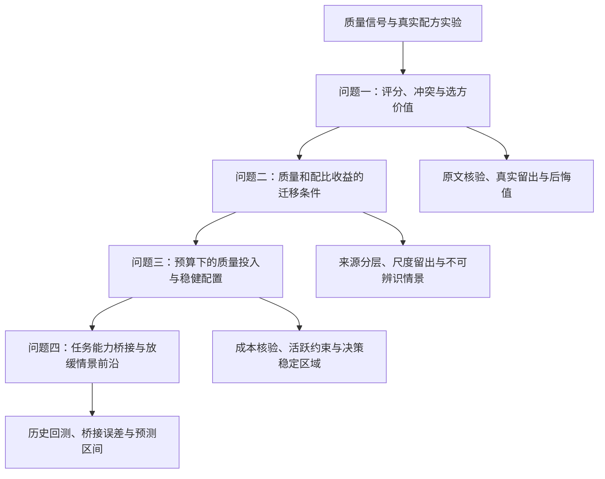

# 论文故事线与完整大纲

建议题目：**数据价值的跨尺度迁移与算力约束下的稳健资源配置**。

本文是基于完整上传版本的队内研究提纲。A/B/C 前三问均有代码与结果，B 另有第四问探索分析。核验发现 B/C 第三问单位错配、C 可信域约束混用，以及 B 第四问区间和桥接口径问题；受影响结果必须修复重算。下文明确区分可复用结构与新增建议，不能把尚未完成的修复和稳健实验描述为已有结论。核心模型、推导和论证须由队伍理解、选择并核验，正式论文按题面要求披露 AI 辅助环节。

## 1. 一句话主线

**先判断数据组合能否带来可验证的收益，再识别这些收益能够跨来源、跨尺度迁移的条件，最后在收益和成本均有边界的情况下选择算力投入，并将损失改进转为能力前沿情景。			**

论文不按 A/B/C 分章。三路线分别贡献可解释对照、机制候选和非线性实证；四问共同回答“有限预算下哪些数据投入值得信任”。

### 1.1 开篇应提出的矛盾

“质量评分高”“配比预测准”“固定预算下值得投入”是三个不同判断。

- A 的线性配比预测在 1M 上优于均值，但选中配方的后悔值高于随机选方期望。
- C 的无 Q 森林把 1M 综合 RMSE 从约 0.228 降到 0.119，真实跨尺度排序也改善；加入固定质量特征只带来很小增益。
- A 的质量修正在 B6/B7 上为正、B8 上反号；Q1 分数到 B 的质量坐标未经验证。
- B 的二次模型在 1B 上排序相关优于 A，却选中最差候选；C 森林的优势也不能直接迁移为未经标定的有效 Token 倍率。
- A 的成本求解数值与解析一致，但固定 Q 使三类质量成本全部不激活；B/C 的联合质量求解已有实现，却需先修复单位后才可判断质量投入规律。

实现错误属于必须排除的前置缺陷，不作为科学发现；修复后再使用跨来源与跨尺度分歧推进故事。这组矛盾足以驱动研究，无须预设“大模型不如高质量数据”或“预算增长必有相变”。已有数字与来源见 [三条线分析报告](./01_三条线分析报告.md)。

### 1.2 可证伪的主要假设

**主要假设 H：在统一目标与质量坐标、限制跨尺度迁移强度后，考虑模型不确定性的资源方案，可以以有限的名义性能代价降低情景后悔值。**

H 尚未验证。若稳健配置和名义配置几乎一致，结论应改为“给出稳定决策区域”；若稳健性代价很大而压力测试无改进，则不保留复杂稳健优化作为主贡献。

辅助问题只保留一个：质量投入是否存在由边际收益与边际成本共同决定的进入/退出边界？它可以给出平滑变化、边界切换或无转移，不能提前规定三阶段。

### 1.3 逻辑链与章节连接

## 2. 摘要写作骨架

摘要最终按“问题—方法—结果—边界”写一段，约束如下：

1. 问题：数据质量分、配比收益和算力投入之间缺少可直接迁移的统一尺度。
2. 方法：质量冲突审计与固定目标配比预测；来源分层广义标度律；三类成本下的联合配置与不确定性传播；任务级 Loss–Benchmark 桥接。
3. 当前可用结果：可选择报告 1M 的 0.228→0.119 RMSE、真实尺度排序改善，以及远尺度估算表不一致，明确模型和评价口径。
4. 待补结果：统一口径下的质量效应区间、修正后的质量进入边界、稳健决策代价与收益，以及修正区间后的未来 12/24 个月能力情景；旧 B/C 预算结果不得直接填入摘要。
5. 边界：半合成质量证据和估算大规模损失只用于条件分析，跨来源关联不直接解释为因果。

不要把每个 baseline 的算法名称堆进摘要，也不要把数学上由假设推出的结论写成真实训练发现。

## 3. 第一章：问题重述与数据证据结构

### 3.1 把题目重述为三个决策层次

- 测量层：什么是高质量，哪些指标冲突反映领域特征？
- 响应层：质量和配比能在多大范围内预测 Loss，收益如何随规模变化？
- 决策层：收益是否足以覆盖质量处理和上下文开销，是否转化为下游能力？

### 3.2 数据清单与证据等级

正文给一张简表，附录给全量利用清单：

| 数据               | 作用                     | 不能混淆的边界                                |
| ------------------ | ------------------------ | --------------------------------------------- |
| A1–A3             | 质量评分与扩展检查       | 按域/ID 去重；A1 与扩展重叠；域样本量不平衡   |
| A4/A5              | 配比响应训练             | 17 域输入、13 域固定评价目标                  |
| A6–A11            | 最终真实检验             | 已见结果后再改方法要披露探索性分析            |
| A12–A15           | 大规模外推一致性         | Loss 为估算，配比为训练子集，不是新增真实验证 |
| B1                 | 经典标度律主拟合         | 同一模型多个检查点相关，按轨迹分组            |
| B2 或 B3           | 族外/轨迹对照            | B2 半合成、B3 插值，分别标记                  |
| B4/B5              | 跨族与文献验证           | 检查 tokenizer、验证语料和来源差异            |
| B6–B8             | 质量机制补充             | 半合成，不能合并后冒充大样本真实干预          |
| B9/B10             | 大模型外推讨论           | 真实规模元数据与估算 Loss 分开                |
| C1或C2、C3、C4、C8 | 演进、元数据、逐任务能力 | 模型类型、许可证、日期和去重口径冻结          |
| C5/C6、C7          | 能力桥接、上下文场景     | 桥接按可比性等级；上下文外生                  |

本章交付：版本化数据图谱、单位表、去重表和一张“真实/半合成/插值/估算”图例。

### 3.3 统一符号与假设

使用 N、D 表示实际参数数和 Token 数；n=N/10⁹、d=D/10⁹ 为拟合坐标。ℓ 表示上下文，避免与 Loss 的 L 混淆；v 表示固定评价权重，p 表示训练配比，两者绝不能联动来人为降低目标。

区分样本文本质量 qᵢ、领域质量 qⱼ、基线配方质量 Q₀，以及可通过处理提升的质量 Q。不同定义下的 [0,1] 不是自动可比；每个转换必须落盘。

主要假设逐条列明并配敏感性：跨来源质量映射、配比收益迁移强度、质量处理成本、可用规模支持域。不要把“质量总是有效”“时间效应都是技术进步”列为无需检验的假设。

## 4. 第二章／问题一：从文本评分到配方的决策价值

### 4.1 发现：质量指标冲突具有领域结构

保留全量方向统一、列表压缩、A1 参考归一化和域级聚合。将通用语言/格式指标与专业内容指标分开检查。按域、冲突强弱抽取原文供队员核验；A2/A3 没有正文时，不声称直接完成同等原文核验。

模型主版本尽量可解释：等权或分组等权评分；C 熵权作为对照。若引入领域修正，先由原文证据说明“这是领域风格还是低质量”，不能仅为提高某域得分而校正。

建议正文图 1：指标组冲突案例 + 七域评分与区间。将样本不确定性和“换一套评分规则”的模型不确定性分开展示。

**已有：** A/C 原附件全量评分与去重数量、C 熵权集中度及冲突诊断；B 的组几何均值评分可作对照，但需先从同源重建集切回相同题目附件。
**待补：** 统一预处理、方向审查、独立人工核验与规则稳定性。

### 4.2 分析：质量代理和训练价值不是同一个量

设固定综合目标为

\[
Y(p)=\sum_{j=1}^{13}v_jL_j(p),\qquad v_j=1/13.
\]

保留逐目标 Loss，不因综合指标好看就忽略某些任务退化。说明 17→7 域映射的 direct、near_direct、inferred 层级；C 当前只在有限映射域上构造质量特征，不能把缺失代理当作观测质量。

若 Q(p)=qᵀp，则给出其与 p 的确定关系，解释不能从加入这一列的消融识别独立质量效应。

### 4.3 方法：可解释响应与非线性预测分工

统一上游后，在训练内部比较：

- A 岭回归：廉价、可解释的最低基准。
- B 正则二次配比模型：有条件解释非线性和组合效应的候选。
- C 森林及逐目标森林：强预测对照，限制在经验支持附近。

主模型由训练内部表现与复杂度决定。若逐目标选择岭回归/森林，应在训练内嵌套验证中完成，不用最终检验域表现决定模型再回报同一测试分数。

二次项需要在单纯形的可识别坐标中解释。领域“增加”必须说明从哪个领域或哪些领域扣除；互补关系用保持总和为 1 的局部方向差分，并报告其对参考点的依赖。

### 4.4 检验：从误差走到选方

报告 RMSE、逐域误差、Spearman、top-1/候选集后悔值，并增加配方扰动下推荐集合与损失变化。区间按相同配方做配对重采样；候选数量有限时不把抽样区间误称为全局最优保证。

建议正文图 2：A/C 真尺度排序与后悔值；估算尺度单独背景标识。不能因为估算表反号就声称真实大模型规律反转。

本章结束句的逻辑：**已能在若干真实尺度上选出更好的配方，但要据此配置大规模资源，还必须辨认配比收益和质量效应如何迁移。**

输出接口：冻结 qⱼ、Q₀、p₀、v、fⱼ(p)、候选可信范围、映射等级与不确定性；不只交一个最优 p。

## 5. 第三章／问题二：数据价值的机制表示与迁移边界

### 5.1 基准：先恢复 N–D 规律，再检查跨源偏差

主拟合 B1，保留 A 的经典形式。先做留一规模、轨迹前后检验，再报告 B2/B4/B5 分层误差。B9/B10 只提供大规模外推讨论，不用估算 Loss 与模型拟合良好证明泛化。

建议正文图 3：来源分层残差图。强调 B1 极高拟合度与 B2 跨源退化并存，揭示融合难点。

### 5.2 候选机制：优先检验有效数据量，不直接堆复杂项

采用 B 已实现的有效数据量结构作为简约候选，结合 C 已完成的来源偏移/嵌套诊断重新统一口径。其质量参数由半合成数据支撑，不当作真实干预证据：

\[
L_\theta(n,d,Q,p)=E_\theta+A_\theta n^{-\alpha_\theta}
+B_\theta\{d\,\phi_\theta(Q)\,m_\theta(n,p)\}^{-\beta_\theta}.
\]

其中 φ(Q)>0 表示质量效率，m(n,p)>0 表示配比效率，规定 φ(1)=1、m(n,p₀)=1。在 Q=1、p=p₀ 时退化为经典形式，这是一项可解释的归一化假设，而不是题目强制的唯一形式。

先比较三个层次：经典无 Q；A 的加性 Q；B 的有效 Token 模型 φ(Q)=Q^κ（Q>0）。只有分组验证稳定改善，才尝试规模相关 κ(n) 或配比交互。

不得同时自由拟合来源截距、质量重标度、κ、配比强度和规模交互。缺少共同锚点时，只报告可识别组合及情景集合 Θ。对于互不兼容的 Loss 来源，先分别建模或校准，不能把原始 Loss 混成一个共同目标。

**重要接口：** Q1 的文本质量分到这里的 Q 需要映射 T。B6/B7/B8 的同刻度假设不成立时，T 属未辨识情景。成本函数也必须使用相应坐标，不能只变收益端的 Q 而保持成本数值不变。

### 5.3 防止重复计算质量与配比收益

f(p) 已经包含真实配方的综合变化；再加一个依赖同一 p 的 Q(p) 可能重复计入收益。建议先固定由 Q1 选定的可信配方，在该配方下定义基线 Q₀，再讨论额外质量处理。

如扩展为联合配比选择，应明确 Q₀(p) 与处理增量，并将 m 表示为基线配方差异、φ 表示为同一配方上的额外质量提升。若数据不能分离二者，保留情景，不声称分别估出两个独立效应。

A 的 f(p) 到 B 的绝对量级迁移系数尚未识别：若只有排序可信，可把 p 固定或限定少量候选，而不是随意把 1M 的 Loss 差完整加到 70B。

### 5.4 弹性与质量—参数替代

固定 p，简单有效 Token 模型中令

\[
U=A n^{-\alpha},\quad V=B[dQ^{\kappa}m]^{-\beta}.
\]

若 m 不依赖 n，则 ∂L/∂ln n=−αU，∂L/∂ln d=−βV，∂L/∂Q=−βκV/Q。弹性分母需明确是 L 还是 L−E；两种不能混写。

质量从 Q 提升 ΔQ 的收益为

\[
\Delta L_Q=V\left[1-\left(1+\frac{\Delta Q}{Q}\right)^{-\beta\kappa}\right].
\]

在原质量下用扩大参数获得同等收益，需要

\[
\frac{n'}n=\left(1-\frac{\Delta L_Q}{U}\right)^{-1/\alpha},
\quad 0\le\Delta L_Q<U.
\]

若 ΔL_Q≥U，仅扩大参数在该可分离模型中不能有限地达到同等改进。Q+ΔQ≤1、κ 的证据层级、规模支持范围都需标明。这是**固定 D、p 的等损失替代**，不是等预算替代；后者由下一章解决。以上为候选模型的代数推演，队伍应独立核验。

建议正文图 4：质量—参数替代曲线与来源/映射情景带，包含无法识别或超出支持范围的区域。

本章需保留C的反证：加入来源偏移使SSE约16.989→6.800，是质量通道之前最大的改进；B8质量通道压至零边界。避免只拿B6/B7的窄参数区间写成普适质量收益。

本章结束逻辑：**质量可以用有效数据量解释，但是否值得购买，取决于其边际收益能否抵偿挤占训练 Token 的代价。**

## 6. 第四章／问题三：质量投入边界与稳健配置

### 6.1 共同预算与成本

**先做物理单位锚点测试：** N=10⁹、D=10¹¹、Q=1、h=1 时，经典项应约为2.385578；B/C旧第三问约1.691141是错误单位造成的。损失用n=N/10⁹、d=D/10⁹，成本用实际N、D；数值与解析必须独立核验。C的L1半径0.6要真正限制主解，区域外候选另表。

对于给定 ℓ，使用实际单位

\[
C_{tot}=D\{(6+\eta\ell)N+[g(Q)-g(Q_0)]_+\}\le C,
\quad \eta=2\times10^{-4}.
\]

初版可固定可信 p，联合求 N、D、Q，满足题目允许固定配比的条件并说明其源于迁移证据有限。若联立 p，使用上一章定义的 Q₀(p)，同时检查域供给约束是否有数据支撑。

比较题设三种 g：10⁷exp(6Q)、5×10⁹Q⁴、2×10⁹ln(1+10Q)。它们均在同一基线处取增量，参数是题设成本代理，不能视为从训练实验拟合的现实价格。

### 6.2 用解析结构降低优化难度

在 Loss 随 D 单调下降且无 D 上限时，预算取等号，将

\[
D=\frac{C}{(6+\eta\ell)N+g(Q)-g(Q_0)},\qquad Q\ge Q_0
\]

代回目标，得到 N、Q 二维问题。用 log N 网格、多起点和边界检查；A 的 Q=Q₀ 解析解作为退化情形核验。若设置供给上限，预算可能有剩余，不强行用完。

### 6.3 质量进入条件：一个值得重点检验的机制

设 k=(6+ηℓ)N+g(Q)−g(Q₀)。在简单有效 Token 模型下，固定 N、p、预算，对 Q 求导，数据项的变化方向由

\[
\frac{dL}{dQ}=\beta V\left[\frac{g'(Q)}k-\frac{\kappa}{Q}\right]
\]

决定。在 Q=Q₀ 的右侧，若

\[
\frac{\kappa}{Q_0}>\frac{g'(Q_0)}{(6+\eta\ell)N},
\]

小幅质量投入能降低模型预测 Loss；反向不等式表示局部继续停留在质量基线。经内层 N 最优解的包络条件，可用于分析局部进入边界。

在Q=Q₀边界必须使用向右导数g′(Q₀)，不能因增量成本此刻为零就将其右导数置零。此条件适用于Q^κ机制；指数型效率φ(Q)=exp[κ(Q−1)]需将κ/Q改为κ。

这只是**局部判别**。对数型成本为凹函数，非凸目标可能存在分离的更优解；即使边界局部不值得投入，也必须扫描全域验证。κ 未被真实数据识别时，边界应显示为情景区间，不给虚假的精确临界预算。

### 6.4 定义结构性转移，允许“未发现”

定义为最优解活跃约束集合改变，或存在可重复的最优分支切换，例如 Q*=Q₀→Q*>Q₀、Q*到达上限、受证据支持的数据供给约束激活。N*随 C 变大、三档成本份额不同、离散网格跳一格，都不足以证明结构性转移。

至少覆盖 10¹⁹、10²²、10²⁴ FLOPs，补连续 log 预算路径。变化点附近加密、检查 KKT/边界条件、跨成本形状与参数情景重算。额外数据墙约束只能作为明确的假设情景，不能为了制造转移添加。

### 6.5 稳健决策：减少跨模型推荐分歧

在已校准到可比较目标的情景 Θ 内，可采用最小最大后悔：

\[
x_R=\arg\min_{x\in\mathcal F(C)}\max_{\theta\in\Theta}
\left[L_\theta(x)-\min_{z\in\mathcal F(C)}L_\theta(z)\right],
\quad x=(N,D,Q,p).
\]

若成本/基线质量也不确定，应将可行域改为所有情景均可行的交集，并对名义方案、稳健方案使用相同规则。不可将 Loss 单位不兼容的模型直接并列求最大后悔。

不能把单位错误、不可行候选或未实际执行的κ配置当作情景不确定性。κ=0对照应真实运行并落盘；C旧核心表只包含κ=0.804707，不能据配置列表声称全κ消融完成。

只保留少量可解释情景轴：质量映射、质量效应来源、配比迁移强度。报告名义损失代价、压力情景后悔值、质量投入方向是否一致。情景测试是模型条件测试，不是新真实实验。

### 6.6 上下文敏感性

解析给出 ℓcrit=6/η=30000，结合 C7 可行值计算。Cattn/Ctrain=ηℓ/6 与 N、D 无关，这是题设结构；但联合质量投入后“注意力占总预算比例”还受 CQ 影响，不能继续套用 A 的无质量份额。

建议正文图 5：连续预算下 N*、D*、Q*、三类成本份额、活跃约束和支持域；不同 g 或 ℓ 分面。图 6：名义与稳健策略的后悔值、收益代价及稳定区域。

本章结束逻辑：**得到的是特定成本与质量证据下的投入建议；最终还需检验 Loss 的改进是否对应可观察的任务能力收益。**

## 7. 第五章／问题四：能力桥接、演进分解与未来情景

B 已完成第四问探索实现：C8 聚合1859模型、24任务，与汇总BBH相关约0.9979；但高可比桥接仅7点、R²约0.158，现有前沿区间未实际传播桥接误差。下文复用其数据处理与回归起点，修正后才形成四问闭环，不照搬旧预测区间。

### 7.1 建立可比较的能力面板

使用 C1或C2 与 C3，以 C4 补充参数、训练计算量、数据量和开源权重字段。冻结开源筛选、pretrained/chat/finetuned 分类和日期口径。主时间轴选一种并说明，其他日期作敏感性，不混在一条增长曲线上。

C8 每个目录取最新可解析记录，处理损坏记录并报告覆盖率；至少做一项逐任务到六维能力的聚合及与汇总表的核验。避免同一底座的大量微调模型被当成独立技术突破。

### 7.2 从 Loss 到任务能力

对每项任务 k 建立单调桥接 Bk=hk(L,type)，高可比数据为主，中可比数据只作分层或敏感性；验证按模型族划分，限制小模型桥接外推到高能力区。

综合能力权重预先固定；若使用有界变换或相对随机基线归一化，说明各任务基线和量纲。不能把 Q1 的 13 域 Loss 评价权重直接当作六维 Benchmark 权重。

图 7：各任务桥接散点、来源层级、预测区间和外推边界。桥接误差若大于优化带来的预测增量，就只报告无法分辨的范围。

### 7.3 规模与非规模贡献

采用分层回归/动力学分解作为初版：能力由规模变量、模型类型、模型族和时间效率项共同解释。数据缺失与共线性使精确贡献比例不可辨识时，报告条件分解区间。

可用顺序平均的反事实分解区分规模变化与剩余效率变化，但必须说明它是模型条件归因；没有识别设计时，不称为因果效果。时间残差含数据工程、架构、对齐、评测组成变化，不能将其全部命名为质量贡献。

避免双计：若 Q、p 已显式进入 Loss 收益，时间效率项只表示剩余变化，不能再把历史全部非规模增长叠加一次。

### 7.4 前沿与 12/24 月情景

先修 B 现有实现：论文重复的时间项与代码统一；点估计和bootstrap使用同一开源总体；C5/C6重复高可比点不当独立样本；算力增长率字段/文字按实际分位回归和OLS重命名。现代码前沿未调用Loss桥接，必须真正接入，或将直接能力回归明确列为独立对照，不能声称已传播桥接误差。

前沿采用固定分位数或其他可解释定义，检验样本量和微调模型数量变化的影响；不只回归每个月单个最高分。预测从冻结的数据最后有效日期起算，不能无说明地从作答当天起算。

情景包括算力增长放缓、不同质量收益可信度、剩余效率增长变化，输入上一章资源配置路径，并做滚动时间回测。训练和校准不能使用未来时间的数据。

图 8：各情景未来前沿及区间，区分参数误差、质量映射、资源情景和桥接误差。不确定性包络不自动是 95% 置信区间，要注明生成方法。

## 8. 第六章：综合讨论与结论

按研究问题收束，而不是按算法报喜：

1. 哪些配比收益由真实留出支持，哪些只在估算表中出现？
2. 质量分的哪些性质可解释，哪些训练价值仍不可辨识？
3. 什么预算/成本/来源假设下质量投入方向稳定，什么情况下应保守？
4. 是否发现结构转移，来自质量成本、支持边界还是新增供给假设？
5. 哪些 Loss 改善能可信地映射到能力，哪些未来情景无法区分？

若最终没有质量净收益、没有结构转移或无法精确归因，保留这些负结果并解释原因。论文贡献可以是可复核的决策边界，不能靠预设强结论维持故事。

## 9. 最小实验矩阵与阶段选择

| 编号 | 实验               | 只改变什么                  | 核心输出                           | 当前状态                                |
| ---- | ------------------ | --------------------------- | ---------------------------------- | --------------------------------------- |
| E1   | 质量规则审计       | 等权/熵权/分组、冲突规则    | 原文一致性、域排序稳定性           | 三线有结果；B重建样本与原附件需对齐     |
| E2   | 配比受控对照       | 岭回归/二次/森林/逐目标森林 | 同尺度误差、跨尺度排序、后悔值     | 三线已有；统一选参协议与决策稳定性待补  |
| E3   | 标度律机制消融     | 无 Q/加性 Q/有效 Token      | 分组留出、跨源误差、参数可辨识区间 | 三线已有；C双通道仅半合成内部可辨识     |
| E4   | 来源与映射压力测试 | B6/B7/B8、T、配比迁移强度   | 符号、替代边界与策略分歧           | A/C已有诊断；C逐对替代尺度需修正        |
| E5   | 质量联合投入       | 固定 Q / 联合 Q；三类 g     | 净收益、成本份额、局部及全局最优   | B/C已实现，但单位错误使现结果待重算     |
| E6   | 稳健配置与转移识别 | 名义/稳健；预算/上下文      | 后悔值、名义代价、活跃约束         | 转移代码已有且待修复；稳健优化新增待做  |
| E7   | 桥接与前沿         | 任务/来源/时间/情景         | 回测误差、覆盖与前沿区间           | B已有探索结果；区间/桥接/增长率口径待修 |

最小成稿路径：先修复 B/C 第三问单位、C 可信域与边界导数 → 统一原始质量样本与坐标 → 确定并持久化 Q1 预测器 → 用来源分层决定简约质量机制 → 重算联合配置与转移 → 修正 B 第四问的区间、公式与桥接连接 → 只有存在稳定收益才保留更复杂的稳健模型。

B 的机制模型有复用价值，但κ=1.0524依赖半合成B6；应结合C的来源偏移诊断统一估计。若复杂机制没有稳定增益，A加性模型也可保留为主模型，论文故事依然成立。不要为凑齐三条路线把效果欠佳或不可识别的方法强行放进主链。

## 10. 论文图表与附录交付

正文建议 6–8 组图，优先保留：质量冲突与域差异；真实尺度配比后悔值；来源分层残差；质量—参数替代边界；预算配置与活跃约束；任务桥接与前沿。

附录包括：全量数据利用清单、共享配置与上游哈希、完整消融、来源标签、优化可行性与多起点检查、原文核验记录、复现命令、AI 辅助与人工核验说明。B 的同源重建与题目原附件差异、C 缺少外部预处理快照，以及森林对象未持久化的问题，应在整合时解决或明确保留为复现限制。
